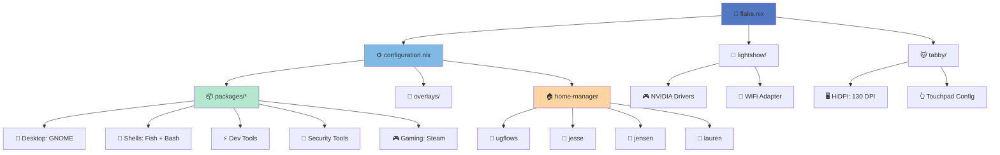
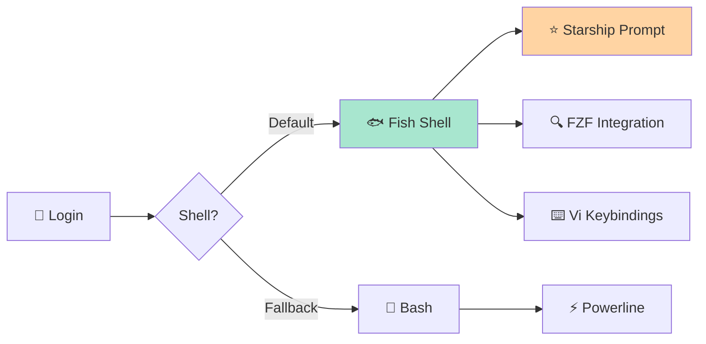
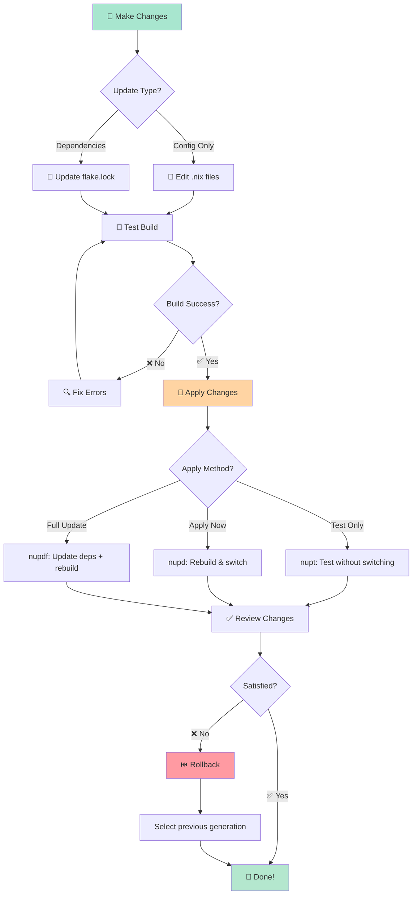
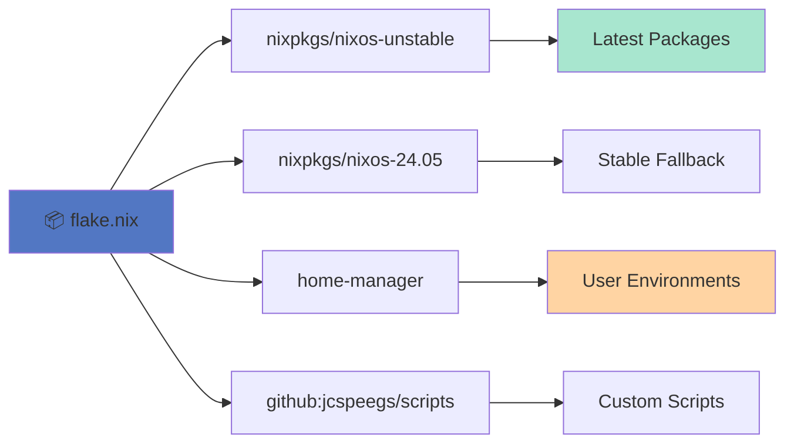

# 🏗️ NixOS Configuration Flake

> 🎯 Declarative, reproducible system configurations for all my machines

[](https://nixos.org)
[](https://nixos.wiki/wiki/Flakes)
[](https://github.com/nix-community/home-manager)

---

## 📖 Overview

This repository contains my complete **NixOS system configurations** managed using [Nix Flakes](https://nixos.wiki/wiki/Flakes). It provides a fully declarative, version-controlled setup for multiple machines with consistent environments across desktop, development, and security research workflows.

### ✨ Why This Approach?

- 🔒 **Reproducible**: Exact same system state across machines
- 📦 **Version Controlled**: All configs in git with full history
- 🔄 **Atomic Updates**: Rollback to previous generations instantly
- 🧩 **Modular**: Reusable components for easy customization
- 🏠 **Home Manager**: Dotfiles and user configs declaratively managed

---

## 🖥️ Managed Systems

| Machine | Type | Description |
|---------|------|-------------|
| 🌟 **lightshow** | Desktop | High-performance workstation with NVIDIA GPU support |
| 🐱 **tabby** | Laptop | Mobile setup with high-DPI display and touchpad optimization |

---

## 🏛️ Architecture



---

## 📂 Repository Structure

```
.
├── 🎯 flake.nix                    # Flake entry point & dependency management
├── ⚙️ configuration.nix            # Shared base configuration
├── 🔒 flake.lock                  # Locked dependency versions
│
├── 🖥️ Machine Configurations
│   ├── lightshow/
│   │   ├── lightshow.nix
│   │   └── hardware-configuration.nix
│   └── tabby/
│       ├── tabby.nix
│       └── hardware-configuration.nix
│
├── 📦 packages/                   # Modular configuration components
│   ├── systemPackages.nix        # System-wide package list
│   ├── users.nix                 # User accounts & home-manager
│   ├── gnome.nix                 # GNOME desktop environment
│   ├── vim.nix                   # Vim with Python dev setup
│   ├── tmux.nix                  # Tmux configuration
│   ├── bash.nix                  # Bash shell
│   ├── fish/                     # Fish shell (default)
│   ├── scripts.nix               # Custom scripts overlay
│   ├── steam.nix                 # Gaming platform
│   ├── qtile/                    # Alternative window manager
│   ├── rofi/                     # Application launcher
│   └── git/                      # Git configuration
│
└── 🔧 overlays/                  # Package customizations
    └── default.nix               # i3ipc, lastpass-cli fixes
```

---

## 🎨 Feature Highlights

### 🖥️ Desktop Environment

- **Primary**: GNOME Desktop with GDM
- **Alternative**: Qtile tiling window manager (optional)
- **Launcher**: Rofi with custom themes
- **Fonts**: Nerd Fonts (FiraCode, Hack) for icon support

### 🐚 Shell Environment



**Features**:
- 🐟 **Fish Shell**: Modern shell with auto-suggestions
- ⭐ **Starship**: Beautiful, fast prompt
- 🔍 **FZF**: Fuzzy finder with bat preview
- ⌨️ **Vi Mode**: Vim-style editing in shell
- 📝 **Custom Aliases**: Optimized workflows

### ⚡ Development Tools

#### 🐍 Python Development
- **Editor**: Vim with jedi-vim, ALE, flake8, black, isort
- **Tools**: Full Python 3 stack with development packages

#### ☸️ Cloud & DevOps
- `kubectl`, `helm`, `argocd`, `kubeseal`
- Docker and Kubernetes tooling
- Tailscale VPN

#### 🛠️ Modern CLI Tools
- **Search**: `ripgrep`, `fd`, `fzf`
- **Display**: `bat`, `eza`, `glow`
- **Dev**: `direnv`, `devenv`, `gh`
- **AI**: `claude-code`
- **Terminal**: `tmux`, `ttyd`, `vhs` (terminal recording)

### 🔐 Security & Pentesting

**Network Analysis**:
- `nmap`, `tshark`, `kismet`, `wavemon`
- `aircrack-ng`, `wifite2`, `airgeddon`

**Web Security**:
- `burpsuite`, `nikto`, `sqlmap`, `wpscan`
- `hydra`, `metasploit`

### 🎮 Gaming & Media

- 🎮 **Steam**: With remote play enabled
- 🎬 **Video**: `obs-studio`, `kdenlive`, `mpv`
- 🎨 **Creative**: GIMP, Inkscape
- 🎵 **Music**: Pianobar, Pithos, Plex
- 📺 **Streaming**: Video editing and production tools

### 🌐 Applications

**Browsers**:
- Firefox, Google Chrome, Tor Browser

**Communication**:
- Discord, Telegram, Mailspring

**Productivity**:
- VS Code, LibreOffice suite
- Various system utilities

---

## 🚀 Quick Start

### Prerequisites

- NixOS installed on your system
- Git installed
- Flakes enabled in your Nix configuration

### Initial Setup

```bash
# Clone the repository
git clone https://github.com/yourusername/configs.git ~/projects/configs
cd ~/projects/configs

# Initialize git submodules (for rofi themes)
git submodule update --init --recursive

# Build and switch to the configuration
sudo nixos-rebuild switch --flake .#<hostname>
```

Replace `<hostname>` with either `lightshow` or `tabby`.

---

## 🔄 Update Workflow



### Update Commands

These convenient aliases are available after installation:

```bash
# Test configuration without switching
nupt

# Rebuild and switch to new configuration
nupd

# Update flake.lock, then rebuild (full update)
nupdf
```

### Manual Commands

```bash
# Test build without switching
sudo nixos-rebuild test --flake .#<hostname>

# Build and switch
sudo nixos-rebuild switch --flake .#<hostname>

# Update flake inputs
nix flake update

# Update specific input
nix flake lock --update-input nixpkgs
```

---

## 👥 User Management

The configuration manages **4 user accounts**:

| User | Full Name | Groups | Role |
|------|-----------|--------|------|
| 🧑‍💻 **ugflows** | Justin Speegle | wheel, networkmanager | Primary admin |
| 👤 **jesse** | - | networkmanager | Family member |
| 👤 **jensen** | - | networkmanager | Family member |
| 👤 **lauren** | - | networkmanager | Family member |

All users are configured with:
- Initial hashed passwords
- NetworkManager access
- Home-manager integration for dotfiles

---

## 🔧 Customization Guide

### Adding a New Machine

1. Create a new directory for your machine:
   ```bash
   mkdir my-machine
   ```

2. Generate hardware configuration:
   ```bash
   sudo nixos-generate-config --show-hardware-config > my-machine/hardware-configuration.nix
   ```

3. Create machine-specific config `my-machine/my-machine.nix`:
   ```nix
   { config, pkgs, ... }:
   {
     imports = [ ./hardware-configuration.nix ];

     networking.hostName = "my-machine";

     # Add machine-specific settings here
   }
   ```

4. Add to `flake.nix`:
   ```nix
   nixosConfigurations = {
     lightshow = myMachine ./lightshow/lightshow.nix;
     tabby = myMachine ./tabby/tabby.nix;
     my-machine = myMachine ./my-machine/my-machine.nix;  # Add this line
   };
   ```

### Adding New Packages

Edit `packages/systemPackages.nix` and add to the appropriate category:

```nix
environment.systemPackages = with pkgs; [
  # Add your packages here
  my-new-package
];
```

### Creating Custom Modules

1. Create a new file in `packages/`:
   ```bash
   touch packages/my-feature.nix
   ```

2. Add your configuration:
   ```nix
   { config, pkgs, ... }:
   {
     # Your custom configuration
   }
   ```

3. Import in `configuration.nix`:
   ```nix
   imports = [
     # ... existing imports
     ./packages/my-feature.nix
   ];
   ```

---

## 🧩 Key Components Deep Dive

### Flake Inputs



### System Services

The configuration enables these system services:

- 🔍 **mlocate**: File indexing (hourly updates)
- 🔐 **Tailscale**: VPN mesh networking
- 🖨️ **CUPS**: Printing with Epson drivers
- 🎵 **PipeWire**: Modern audio system
- 🗂️ **GVFS**: Virtual filesystem for Nautilus
- 📚 **Man Pages**: Comprehensive documentation

### Boot Configuration

- **Bootloader**: systemd-boot with EFI support
- **Kernel**: Latest Linux kernel (`linuxPackages_latest`)
- **Graphics**: Hardware acceleration enabled

---

## 🐛 Troubleshooting

### Build Fails

```bash
# Clean build cache
nix-collect-garbage -d

# Retry with verbose output
sudo nixos-rebuild switch --flake .#<hostname> --show-trace
```

### Rollback to Previous Generation

```bash
# List available generations
sudo nix-env --list-generations --profile /nix/var/nix/profiles/system

# Rollback to previous
sudo nixos-rebuild switch --rollback

# Or boot into previous generation from bootloader menu
```

### Update Git Submodules

```bash
git submodule update --init --recursive
```

### Check Flake Status

```bash
# Show flake metadata
nix flake metadata

# Show flake outputs
nix flake show
```

---

## 📚 Resources

- 📖 [NixOS Manual](https://nixos.org/manual/nixos/stable/)
- 🏠 [Home Manager Manual](https://nix-community.github.io/home-manager/)
- ❄️ [Nix Flakes Wiki](https://nixos.wiki/wiki/Flakes)
- 🔍 [NixOS Package Search](https://search.nixos.org/)
- 🛠️ [NixOS Options Search](https://search.nixos.org/options)

---

## 🤝 Contributing

This is a personal configuration repository, but feel free to:

- 🌟 Use it as inspiration for your own configs
- 🐛 Report issues or suggest improvements
- 🔀 Fork and adapt for your needs

---

## 📝 License

This configuration is provided as-is for personal use. Feel free to use, modify, and distribute as you see fit.

---

## 🙏 Acknowledgments

- 🎯 **NixOS Community**: For the amazing ecosystem
- 🏠 **Home Manager**: For declarative dotfile management
- 🌟 **Starship**: For the beautiful prompt
- 🐟 **Fish Shell**: For the modern shell experience

---

<div align="center">

**Made with ❄️ by [Justin Speegle](https://github.com/jcspeegs)**

*Powered by NixOS, the purely functional Linux distribution*

</div>
